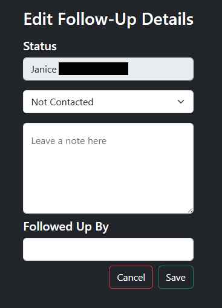
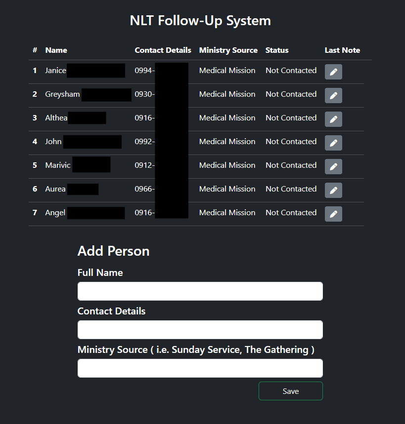

# Church Follow‑Up Tracking System (Laravel)

A Laravel-based web application that helps church admins and ministry leaders
track follow-ups with new attendees by making pending follow-ups visible
and actionable.

## Screenshots

### People List (Primary Screen)

### Update Follow‑Up

## Problem
Church follow‑ups are often inconsistent due to:
- Contact details stored in paper forms or Excel
- Follow‑ups relying on memory
- No clear visibility into who needs follow‑up

## v1 Goal
Make follow‑up needs immediately visible so leaders can take timely action.

## Features (v1)
- Centralized People List
- Follow‑up status per person:
  - Not Contacted
  - Contacted
  - Responded
- Notes per follow‑up
- Simple CRUD flow

## Key Decisions

- Used a single follow-up record per person to simplify data relationships
- Chose manual follow-up tracking over automation to validate the workflow first
- Made the People List the primary screen to support daily usage
- Avoided premature abstractions to keep the codebase readable

## Why This Project Matters

This project was intentionally built as a v1 to practice:
- Translating a real-world workflow into a data model
- Designing relationships (Person → FollowUp)
- Limiting scope to ship a usable system
- Building CRUD flows with clear user intent

The focus was correctness, clarity, and maintainability rather than feature volume.

## What v1 Does NOT Include
- Messaging or SMS
- Automated communication
- Notifications
- Reporting or analytics
- Church operations management

These are intentionally excluded to keep v1 focused and usable.

## Tech Stack
- Laravel
- Blade Templates
- MySQL

## What I Would Improve Next (v2)

- Follow-up history (one-to-many)
- Basic filtering and search
- Role-based access
- Optional messaging integration

## Status
This project represents a **v1 MVP** focused on clarity, usability, and real‑world validation.

Future versions may expand functionality based on actual user needs.
